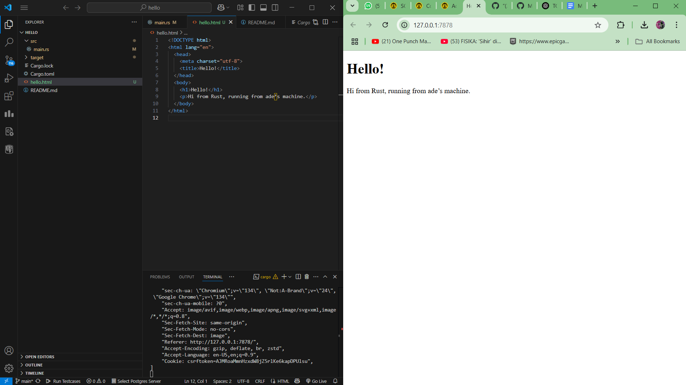
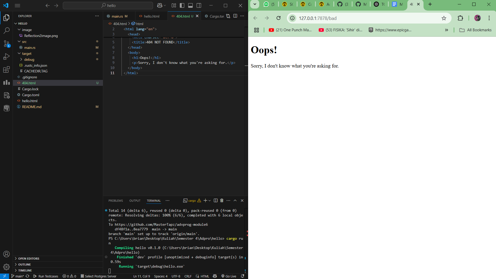

## Reflection 1

The handle_connection function begins by taking a TCP stream as input, which represents an active connection from a web browser sending an HTTP request. It then wraps this stream, which has been set as mutable, with a buffered reader. This buffering helps reduce the number of system calls required. 

Since the stream is now buffered, it allows reading the content line by line using the lines method. Each line is processed using the map function to extract its value, assuming that all lines are read successfully. The function continues reading until it encounters an empty line, which indicates the end of the HTTP header section. The collected lines are stored in a vector of strings and then displayed in a structured format using the println function.

## Reflection 2

This function follows the same approach as handle connection but with a key difference. After reading the request, it generates an HTTP response that includes a status line specifying the version, status code, and message. It also includes the content length, which indicates the size of the data being sent, followed by the actual HTML content that the browser will process.

To achieve this, the function first stores these elements as separate string variables. Using string formatting, it constructs the response and then sends it back to the stream as bytes, allowing the browser to render the content correctly.

## Reflection 3

The main purpose of validation is to check the status line. Within this line, there is a section called the URI, which is the second parameter of the status line in a request. This part contains the URL content after the information about the request destination. The URI helps differentiate between different types of requests being sent.

In this case, the function checks if the request matches GET HTTP. If it does, the server responds with the hello html file. Otherwise, it returns a 404 Not Found error. This approach makes the validation process more efficient, as it only verifies whether the request is valid rather than checking every request individually.

## Reflection 4

After running and analyzing the code, I noticed that the default redirection to hello html was very slow. This happened because the code included a sleep function, which consumed system resources and placed my original request in a queue until the sleep process was completed. As a result, there was a delay in processing, making the loading slow since the program had to wait for the sleep function to finish before handling other requests.

# Reflection 5

Implementing multithreading in the application significantly improved performance by creating worker threads that distribute incoming requests. This approach allows multiple requests to be handled simultaneously, eliminating the need to wait for the sleep function to complete before processing other requests. The process begins by creating a passing channel for each thread, followed by setting up a thread pool with multiple workers, each responsible for handling a single request at a time. Once a worker receives a request, it locks until the task is completed. Each request is wrapped in a function and placed in a box before being assigned to a worker. In this implementation, four workers are used, and whenever a stream is received from the TCPListener, the ThreadPool executes it along with the handle_connection function.